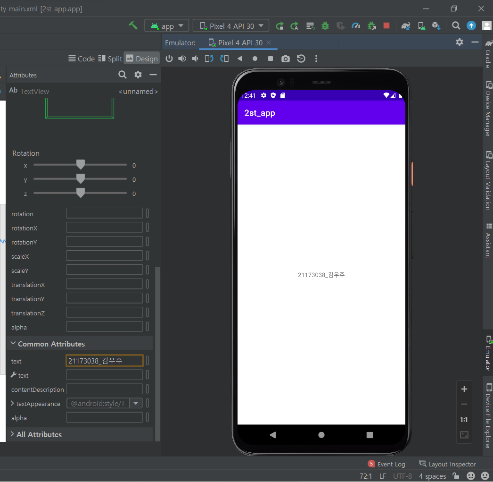
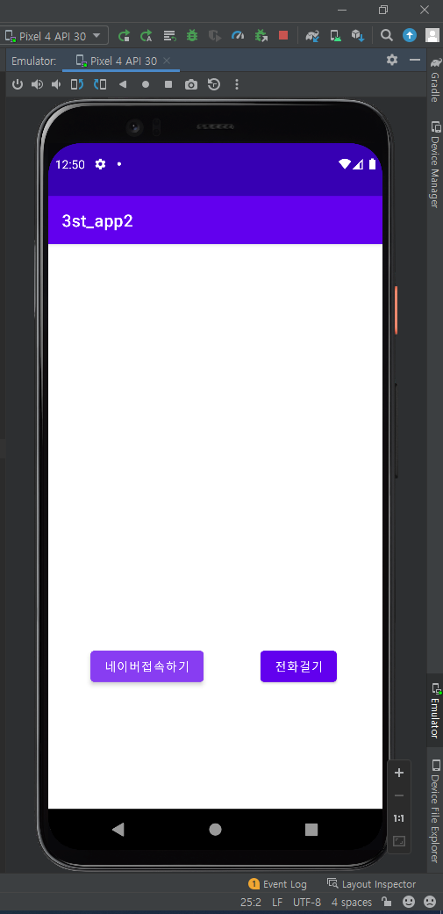
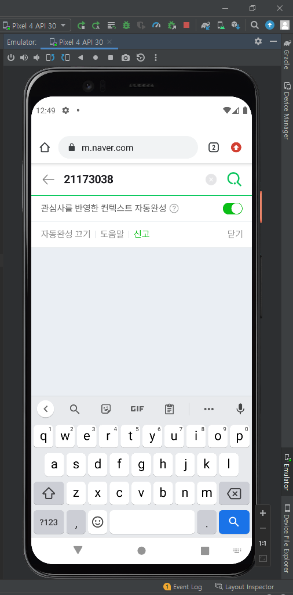
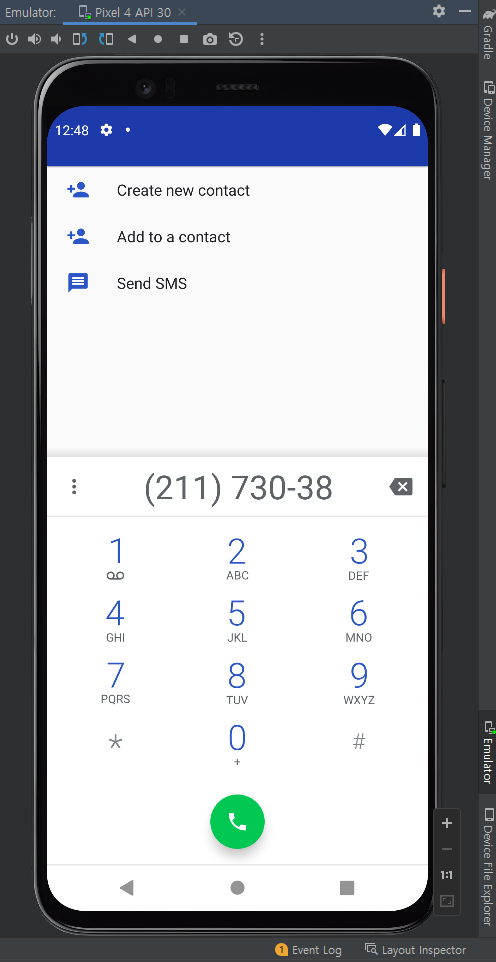
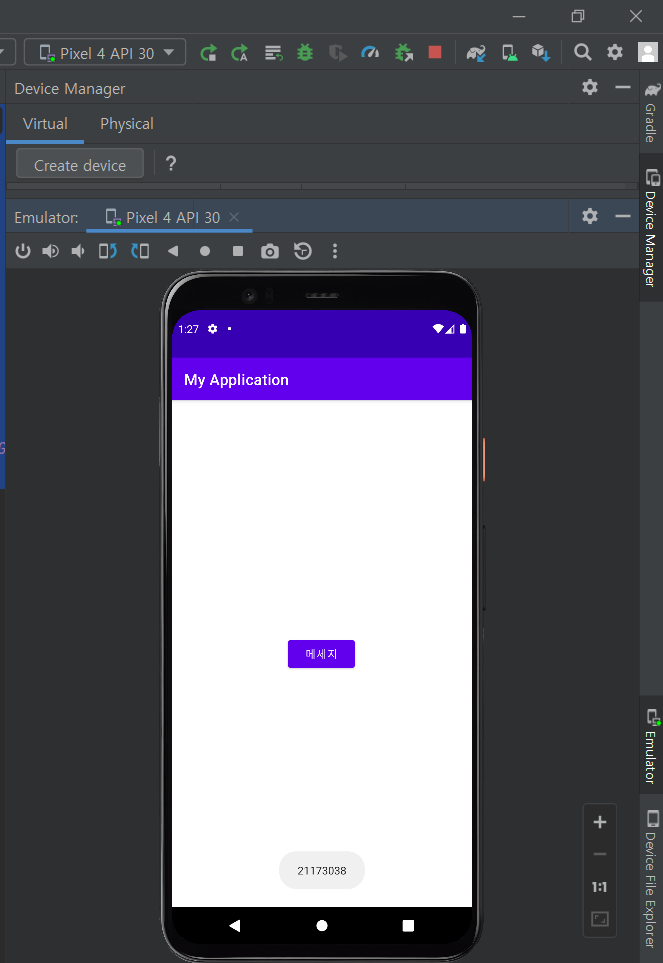
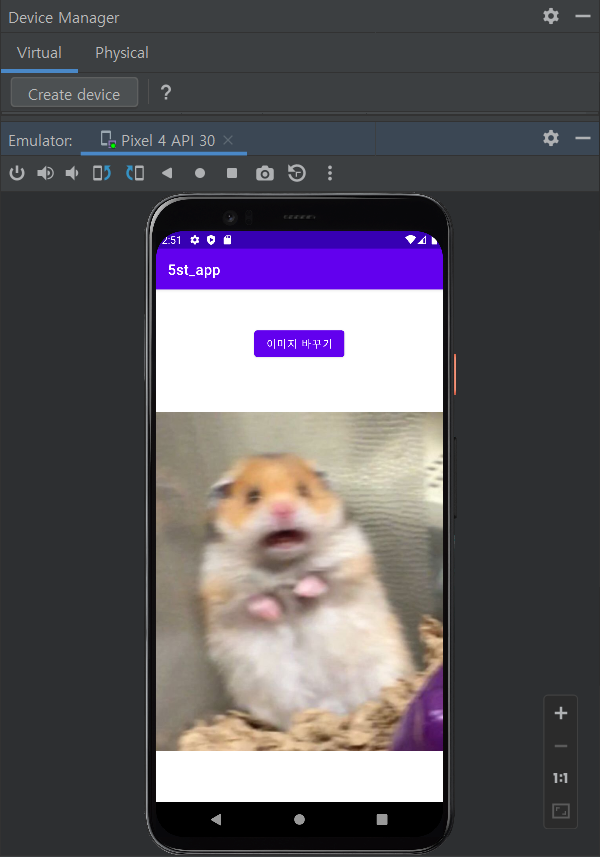
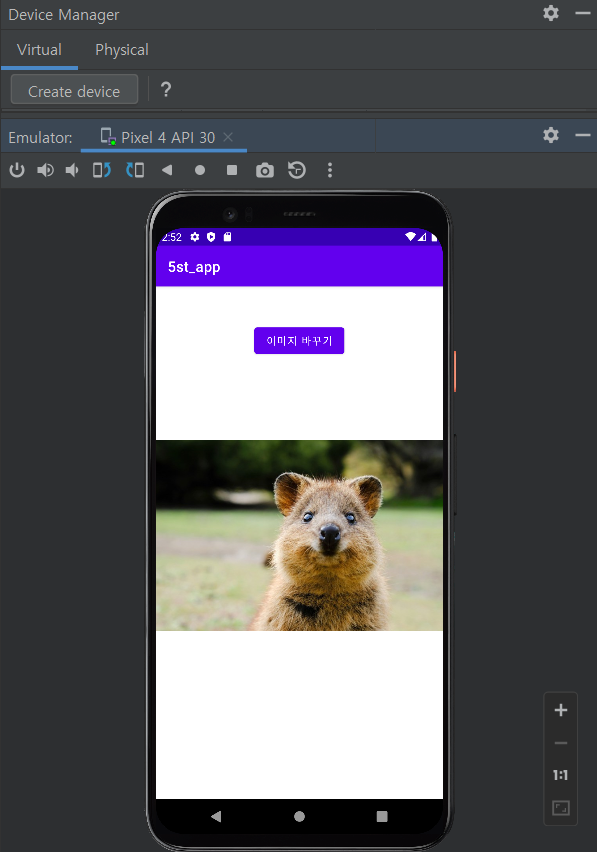
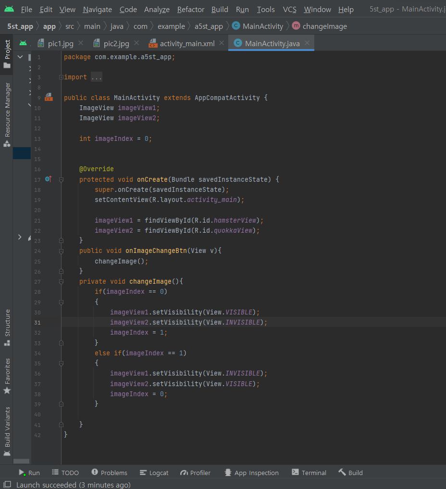
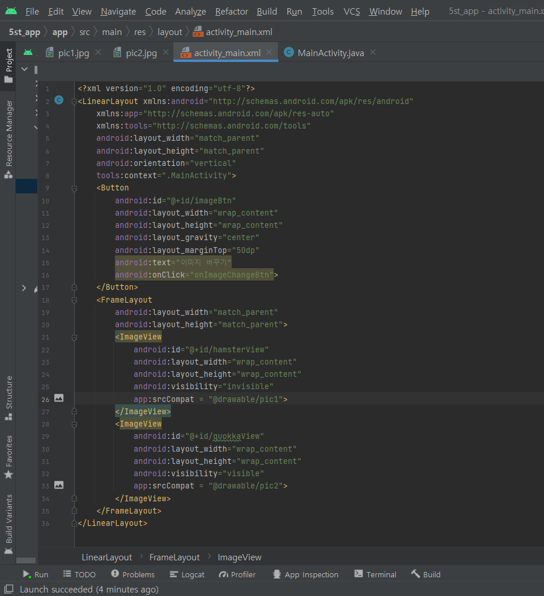

# 2주차 과제(22-03-15)
- 안드로이드스튜디오 설치&& Github 가입 및 레포지토리 만듬
</img> 

# 3주차 과제(22-03-22)
</img> 
</img> 
</img> 

# 4주차 과제(22-03-30)
</img>

# 5주차 과제(22-04-12)
</img>
</img>
</img>
</img>

# 6주차 과제(22-04-19)
</img>
